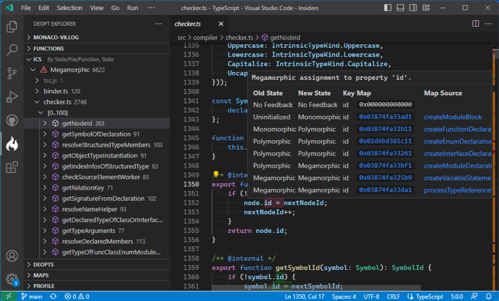

# Benchmarking, Profiling, and Optimizing JavaScript libraries

## Introduction

I wish to bring you with me on a journey to learn about optimizing a library for localization, I would like to share my learnings with you on benchmarking, profiling, and optimizing.

At Swissquote Bank, we use client-composed micro-frontends, and our platforms are usually available in at least 8 languages. To support this requirement, we had to build a translation/localization library for our micro-frontend platform and chose an open-source library, [globalize](https://github.com/globalizejs/globalize).

We chose the library using the following criteria:

- The library must support formatting numbers, dates, and plurals.
- Since our micro-frontend plugins are client-composed, the library must support adding translation strings at runtime.
- It should be easy to add locales to expand into new markets.
- The library must support MessageFormat.

Globalize fulfilled all the above needs and allowed us to dynamically load translations and CLDR data. We also reduced the size of the CLDR dataset to ship only the relevant parts to our clients.

> CLDR (short for [Unicode Common Locale Data Repository](https://cldr.unicode.org/)) is a dataset containing all formatting rules for numbers, dates, currencies, plurals, and more.

## What is MessageFormat?

MessageFormat is a [Unicode standard](https://unicode-org.github.io/icu/userguide/format_parse/messages/) that formalizes how to represent translation strings. It is supported out of the box by at least Java, PHP, and C. 

Since we are using Java for our applications and already have a stack for server-side translations, we wanted to reuse the same tooling for our front-end plugins.

Here are some examples of MessageFormat translation strings:

```jsx
// Simple substitution
render("Hello, {name}!", { name: "John" }); // Hello, John!

// More advanced, with plurals
const message = `You have {numBooks, number} {numBooks, plural, one {book} other {books}}.`;
const variables = { numBooks: 5 };
render(message, variables); // You have 5 books.
```

As you can see, the string contains variables delimited with `{}` and can contain some logic for formatting, plurals, and more. This works great as you can’t just use a string for a singular form and a string for the plural form; many languages have more complex plural rules than English has.

## Too much JavaScript and new opportunities

In 2020, I noticed that the library was huge: 77KB for the library + 79KB for the CLDR data (24 KB + 13KB Gzipped). As a comparison, the rest of our Micro frontend platform is only 32KB of JavaScript.

> Let’s be fair to Globalize; the library is meant to be used with another tool; The [globalize-compiler](https://github.com/globalizejs/globalize-compiler). The globalize-compiler embeds only the required parts of the library and CLDR data. Since we don’t know in advance what we’re going to translate or in which language, we cannot apply this optimization.

I was pretty curious to explore the field for three reasons:

1. [Intl](https://developer.mozilla.org/en-US/docs/Web/JavaScript/Reference/Global_Objects/Intl) APIs can now replace CLDR data, such as [Intl.NumberFormat](https://developer.mozilla.org/en-US/docs/Web/JavaScript/Reference/Global_Objects/Intl/NumberFormat) (supported by some browsers in 2013) and [Intl.PluralRules](https://developer.mozilla.org/en-US/docs/Web/JavaScript/Reference/Global_Objects/Intl/PluralRules#browser_compatibility) (added in 2017).
2. Intl.MessageFormat does not exist yet. It is currently a draft but will support MessageFormat 2, which won’t be backward compatible.
3. Globalize ships with more features than we need, such as date and number parsers, which our apps don’t need.

With this in mind, I wanted to build a library containing only the features we need, smaller and more performant while we’re at it.

## Smaller, Faster, Stronger

> This article is not meant to promote my library; it’s a toy project to explore some techniques and ideas and will be the subject of this exploration.
> Here is the link to the repository if you want to have a look : [https://github.com/onigoetz/i18n](https://github.com/onigoetz/i18n).

Since our initial choice, the landscape of MessageFormat libraries has become richer. There are many options available, and I needed to make a choice. I did not keep my initial analysis, but here is how it is on 30/11/2023:

| Library | Version | Size | Compliant | Notes |
| --- | --- | --- | --- | --- |
| [@eo-locale/core](https://www.npmjs.com/package/@eo-locale/core) | 1.7.2 | 6.7K | No | Can’t parse complex ICU strings |
| [@ffz/icu-msgparser](https://www.npmjs.com/package/@ffz/icu-msgparser)  | 2.0.0 | 13K | Yes | With an incomplete custom renderer |
| [@onigoetz/messageformat](https://www.npmjs.com/package/@onigoetz/messageformat) | 0.1.0 | 17K | Yes | With @onigoetz/intl |
| [@onigoetz/messageformat](https://www.npmjs.com/package/@onigoetz/messageformat) | 0.1.0 | 20K | Yes | With @onigoetz/make-plural |
| [@eo-locale/core](https://www.npmjs.com/package/format-message-parse) | 6.2.4 | 29K | Yes |  |
| [@onigoetz/messageformat](https://www.npmjs.com/package/@onigoetz/messageformat)  | 0.1.0 | 62K | Yes | With @phensley/plurals |
| [intl-messageformat](https://www.npmjs.com/package/intl-messageformat) | 10.5.8 | 71K | Yes |  |
| [@phensley/messageformat](https://www.npmjs.com/package/@phensley/messageformat) | 1.8.0 | 81K | Yes |  |
| [@messageformat/core](https://www.npmjs.com/package/@messageformat/core) | 3.3.0 | 96K | Yes |  |
| [globalize](https://www.npmjs.com/package/globalize) | 1.7.0 | 202K | Yes | It also contains parsers for dates and numbers |

A few more notes:

- `@ffz/icu-msgparser` is the smallest of all, but as it came without a renderer, I built one to pass a few test cases to test the parser’s accuracy.
- My library, `@onigoetz/messageformat`, appears more than once because the formatting libraries aren’t included, and you can bring your own. I made this choice because when starting this effort, the [Intl.PluralRules stats on caniuse.com](https://caniuse.com/intl-pluralrules) were pretty low, and I wanted to leave the option open for future library users. As we will see later, the formatting and plural libraries significantly impact size and performance.

At this stage, I was happy that the library was already small enough. The next step is to see how fast it is.

## Benchmarking

Benchmarking is difficult for quite a few reasons:

1. Statistical significance of benchmarks.
2. We tend to have a [confirmation bias](https://en.wikipedia.org/wiki/Confirmation_bias) toward finding the test that puts your library in the best light.
3. We’re not always comparing the same thing

Some libraries help with the first point, such as [benchmark](https://www.npmjs.com/package/benchmark).

For the second point, I decided to benchmark against four different test strings of increasing complexity to have more than one comparison point.

For the third point, I have an anecdote; on the journey to make my library fast, I had one benchmark on which the fastest library was three times faster than the second library and seven times faster than mine.

It took me a while to understand why: the string contained a variable that required formatting to a number. All libraries applied the formatting except the fastest one, which printed the number as-is. I removed the number formatting from the test string as it wasn’t the goal of the benchmark and [documented a set of rules](https://github.com/onigoetz/i18n/tree/master/packages/benchmark-messageformat#benchmark) to explain precisely what I’m measuring and ensure I measure the same in all libraries.

### Initial Benchmark

Let’s have a look at the initial benchmark with all the contenders.

> As said above, I made multiple benchmarks, but for the sake of brevity, I will present the result of only one benchmark. I invite you to [check all results](https://github.com/onigoetz/i18n/blob/master/packages/benchmark-messageformat/README.md#benchmark) for more information.
The test string is: `Yo, {firstName} {lastName} has {numBooks} {numBooks, plural, one {book} other {books}}.` As you can see, it is one plural rule and three variable substitutions.

|  | Name | Operations/second | Margin of Error | Runs sampled |
| --- | --- | --- | --- | --- |
| 1 | @phensley/messageformat | 520,533 | ± 0.37% | 96 |
| 2 | @messageformat/core | 172,258 | ± 0.07% | 101 |
| 3 | @ffz/icu-msgparser (+ custom renderer) | 129,557 | ± 0.06% | 101 |
| 4 | @onigoetz/messageformat (+ @onigoetz/make-plural) starting point | 126,746 | ± 0.28% | 100 |
| 5 | format-message-parse | 81,703 | ± 0.21% | 98 |
| 6 | intl-messageformat | 46,788 | ± 2.27% | 86 |
| 7 | globalize | 27,273 | ± 0.27% | 93 |

We are already in fourth position with the tremendous initial work from the @ffz/icu-msgparser parser.

### Profiling a library

Optimizing any code through profiling can be reduced to three simple steps:

1. Measure how much each part takes
2. Find the part that takes the longest to execute
3. Make it run faster

And you can repeat that as many times as you wish.

### 1. Measure how much each part takes

You might have already used the Firefox Profiler or Google Chrome’s Dev tools, but have you already profiled in Node.js?

Node.js has a built-in sampling profiler, which can be invoked with the `--prof` flag.

We’ll try it with this code:

```jsx
import run from "./dist/onigoetz-messageformat.js";

const message = `Yo, {firstName} {lastName} has {numBooks} {numBooks, plural, one {book} other {books}}.`;
const options = {
  firstName: "John",
  lastName: "Constantine",
  numBooks: 5
};

console.log(run.default(message, options));
```

And a quick addition to the rendering script to have a bit more output:

```jsx
export default (string, options) => {
  performance.mark("start");
  const parsed = parse(string);
  performance.mark("parsed");
  const rendered = renderer(parsed, options);
  performance.mark("rendered");

  performance.measure("parseTime", "start", "parsed");
  performance.measure("renderTime", "parsed", "rendered");

  performance.getEntriesByType("measure").map(
    p => console.log(`${p.name} ${p.duration.toFixed(2)}ms`)
  );

  return rendered;
};
```

And here’s how to profile it:

```bash
$ npm install -g speedscope
$ node --prof profile.mjs
$ node --prof-process --preprocess -j isolate*.log | speedscope -
```

I zoomed in the profiler on the parsing and rendering of the string, excluding the actual loading of the code since that’s Node.js’ job, there isn’t much we can do there.


### 2. Find the part that takes the longest to execute

We can see two big stacks, and we can see that we are within `profile.mjs` and below that, two stacks: 

- On the left one, we know that we’re spending all the time in `ArrayMap`, and above that, we have `plural`. I understand that it’s the plural resolution in the render phase that takes 5ms the time and that there is no other information about the rest of the parsing and rendering. (we’ll see precisely why in a moment).
- The right stack mentions `log` and `getStdout`. This is the `console.log` at the end of the function.

### 3. Make it run faster

While it’s not precise, we can already get one piece of information: plural resolution is the slowest part.

I went on a side exploration to understand how fast/slow plural resolution libraries are:

| Name | Operations/second | Margin of Error  | Runs sampled | Compiled Size | Included locales |
| --- | --- | --- | --- | --- | --- |
| [make-plural](https://www.npmjs.com/package/make-plural) | 14,310,209 | ± 0.71% | 96 | 20KB | All |
| [@phensley/plurals](https://www.npmjs.com/package/@phensley/plurals) | 12,529,550 | ± 0.24% | 102 | 48KB | All |
| [@onigoetz/make-plural](https://www.npmjs.com/package/@onigoetz/make-plural) (memoized) | 11,836,619 | ± 0.37% | 101 | 6.6KB | One |
| [@onigoetz/intl-formatters](https://www.npmjs.com/package/@onigoetz/intl-formatters) | 2,143,555 | ± 0.35% | 98 | 3.9KB | All |
| [@onigoetz/make-plural](https://www.npmjs.com/package/@onigoetz/make-plural) | 56,021 | ± 0.64% | 95 | 6.6KB | One |

> `@onigoetz/make-plural` is a fork of an older version of `make-plural` that supported CLDR data as input.

This tells me two important things; I’m using the slowest plural library there is, and `@phensley/messageformat` is using one of the fastest options. Let’s try to replace the plural library with `Intl.PluralRules`, which is used in `@onigoetz/intl-formatters`. Here are the results:

|  | Name | Operations/second | Margin of Error | Runs sampled |
| --- | --- | --- | --- | --- |
| 1 | @phensley/messageformat | 520,533 | ± 0.37% | 96 |
| 2 | __@onigoetz/messageformat (+ @onigoetz/intl-formatters) replaced formatter__ | __401,907__ | ± 0.32% | 100 |
| 3 | @messageformat/core | 172,258 | ± 0.07% | 101 |
| 4 | @ffz/icu-msgparser (+ custom renderer) | 129,557 | ± 0.06% | 101 |
|  | @onigoetz/messageformat (+ @onigoetz/make-plural) starting point | 126,746 | ± 0.28% | 100 |
| 5 | format-message-parse | 81,703 | ± 0.21% | 98 |
| 6 | intl-messageformat | 46,788 | ± 2.27% | 86 |
| 7 | globalize | 27,273 | ± 0.27% | 93 |

At this stage, we didn’t change any code, we just replaced the plural library and jumped from 126,746 to 401,907 operations per second, not bad!

## What is the next thing we can optimize?

As said before, we can repeat the process as much as we want. Let’s do that and go for a second round.

### 1. Measure how much each part takes

We wanted to get the fastest library, not the second fastest, so let’s start a second round of optimization. Let’s get a new profile:


Again, we have two stacks, and we can still ignore the right stack with the console.log and focus on the left one.

Curiously, the “plural” part is still taking the entire length of that stack, and it’s taking 6.25ms, which is longer than the 5ms we measured previously.

This surprising measurement is because Node.js’ profiler is a *sampling* profiler.

> A *sampling* profiler will take a snapshot of what’s currently running every few ms and will then try to fill in the gaps of what it didn’t see between the samples; if a function was running in sample 1 and sample 2, it will consider that it was running the whole time.

Luckily, there is a lower level option; `perf`. It is a command and a module to the Linux kernel that gathers samples on your machine’s processes. As I’m performing this research on a MacBook, I had to run the following within a Docker image.

```bash
$ perf record -e cycles:u -g -- node --interpreted-frames-native-stack --perf-basic-prof --perf-prof-unwinding-info profile.mjs
parseTime 0.80ms
renderTime 0.28ms
Yo, John Constantine has 5 books.
$ perf script | egrep -v "( __libc_start| LazyCompile | v8::internal::|node::Start\(| LazyCompile | Builtin:| Stub:| LoadIC:|\[unknown\]| LoadPolymorphicIC:)" > perfs.out
```

The first command collects the performance report in a raw format, and the second one transforms it into something other tools can understand and removes some of the verbosity.


Well, There is a lot of information here, but the execution of the code itself doesn’t even appear. Since each function runs in less than a millisecond, they don’t appear in the samples.

### 1.1. Measure how much each part takes

We’ll try another approach: [pprof](https://www.npmjs.com/package/pprof). pprof is a suite of profiling tools by Google that integrate nicely into Node.js and work cross-platform.

```bash
$ node --require pprof profile.mjs
parseTime 0.46ms
renderTime 0.30ms
Yo, John Constantine has 5 books.
$ speedscope pprof-profile-84760.pb.gz
```


As you can see, pprof has the same minimum resolution time of 2ms. There are also missing functions (`parse` still doesn’t appear). It also seems that the bars don’t have a precise size; they get extended to fill the 2ms minimum.

### 1.2. Measure how much each part takes

It’s puzzling that Chrome and Firefox can give detailed performance traces of the code you run but Node.js can’t. But did you know that you can use Chrome Dev tools with Node.js?

Let’s try this option

```bash
$ node --inspect-brk profile.mjs
Debugger listening on ws://127.0.0.1:9229/57f50d1c-51c0-4d55-9d38-64b21933af44
For help, see: https://nodejs.org/en/docs/inspector
```

This will start nodeJS and wait for a debugger to be attached. 

1. You can head to your favorite Chromium-based browser
2. Open `chrome://inspect` 
3. In the “Remote Target” section, you should see a line that contains the path to the script you started. Click on “Inspect”.
4. Go to the “Performance” tab and click on the record button
5. Stop the recording when your script is finished

> You might want to disable your browser extensions to remove noise from the final trace. Head to `chrome://extensions/` to do so.

Here is the result for the script, zoomed in on the rendering. The part outside of the visible area is the `console.log` calls.


This is the most precise output I got to profile my library. We can see that we have a few longer bars on the parsing side, but they seem to be proportional to the size of the input we are treating. On the rendering side, it’s the plural rendering that is still the longest (as we saw, we’re not using the fastest option that exists; more on that later).

### 2. Find the part that takes the longest to execute

At this stage, I find no low-hanging fruit in optimizing this library further. I could still do some micro-optimizations, such as Regex improvements or early bailout, but it seems it won’t bring huge improvements. We have another option.

I loved these talks that went very deep on the performance implications of how to organize data for computation:

1. [A talk by Andrew Kelley, creator of Zig about Data-Oriented Design](https://vimeo.com/649009599)
2. [Fast by default: algorithmic performance optimization in practice by Vladimir Agafonkin](https://www.youtube.com/watch?v=bwA9i6wjfhw)

One day, I stumbled upon [an article on compilers with the idea of a Flat AST](https://www.cs.cornell.edu/~asampson/blog/flattening.html), which made me realize that I could transform the parser's output from a tree to a list. This would allow me to run the rendering within a single for-loop instead of recursively calling the render function.

> I’ve tried various approaches like matching all static tailwind class names up front, putting everything in an object with methods to use like a virtual function table and more. But in the end the fastest and I felt like the easiest to maintain was one giant dumb switch statement.
> 
> — Marvin Hagemeister, [Speeding up the JavaScript ecosystem - Tailwind CSS](https://marvinh.dev/blog/speeding-up-javascript-ecosystem-part-8/)

### 3. Make it run faster

What do I mean by Flat AST? I’ll show you an example; here is the parser result for `{test, plural, one{one test} other {# test} }` in the form of a tree.

```jsx
{
  t: MessageOpType.PLURAL,
  v: "test",
  o: {
    one: { t: MessageOpType.TEXT, v: "one test" },
    other: {
      t: MessageOpType.BLOCK,
      n: [
        { t: MessageOpType.VARIABLE, v: "test" },
        { t: MessageOpType.TEXT, v: " test" }
      ]
    }
  }
}
```

Here is the same, but with the new Flat AST:

```jsx
[
	{
    t: MessageOpType.PLURAL,
    v: "test",
    o: undefined,
    c: true,
    m: {
      one: 1,
      other: 3,
    },
    j: 6,
  },
  { t: MessageOpType.TEXT, v: "one test" },
  { t: MessageOpType.END },
  { t: MessageOpType.ARG, v: "test" },
  { t: MessageOpType.TEXT, v: " test" },
  { t: MessageOpType.END },
]
```

As you can see, the `t` key always contains the type, and the various numbers you can find, such as `j:6`, are the indexes at which to jump. With this structure, we can render by using a simple loop through all items and jump forward in case of plural or select.

The result of this optimization shows that this approach is a huge improvement:

|  | Name | Operations/second | Margin of Error | Runs sampled |
| --- | --- | --- | --- | --- |
| 1 | __@onigoetz/messageformat (+ @onigoetz/intl-formatters) flat AST__ | __540,343__ | ± 0.06% | 99 |
| 2 | @phensley/messageformat | 520,533 | ± 0.37% | 96 |
|  | @onigoetz/messageformat (+ @onigoetz/intl-formatters) replaced formatter | 401,907 | ± 0.32% | 100 |
| 3 | @messageformat/core | 172,258 | ± 0.07% | 101 |
| 4 | @ffz/icu-msgparser (+ custom renderer) | 129,557 | ± 0.06% | 101 |
|  | @onigoetz/messageformat (+ @onigoetz/make-plural) starting point | 126,746 | ± 0.28% | 100 |
| 5 | format-message-parse | 81,703 | ± 0.21% | 98 |
| 6 | intl-messageformat | 46,788 | ± 2.27% | 86 |
| 7 | globalize | 27,273 | ± 0.27% | 93 |

Here is also the trace from that new data structure. As you can see, the overall structure and flame sizes are quite similar to the previous run, except it’s faster now.


Since we saw earlier that the pluralization library itself significantly impacts the result of the benchmark, I decided to check the results with two more pluralization libraries, which are impressive.

|  | Name | Operations/second | Margin of Error | Runs sampled |
| --- | --- | --- | --- | --- |
| 1 | @onigoetz/messageformat (+ make-plural) flat AST | 611,965 | ± 0.32% | 99 |
| 2 | @onigoetz/messageformat (+ @phensley/plurals) flat AST | 597,195 | ± 0.32% | 88 |
| 3 | @onigoetz/messageformat (+ @onigoetz/intl-formatters) flat AST | 540,343 | ± 0.06% | 99 |
| 4 | @phensley/messageformat | 520,533 | ± 0.37% | 96 |

And here is the trace of the fastest of all, which shows that if the plural is fast enough, the rendering is practically instantaneous, leaving some margin of improvement for the parsing part.


I could do a few more rounds of optimization, but you got the idea of what tools you can use to do it yourself.

## Going further, tracking Deoptimization

Interpreted languages such as JavaScript leverage a lot of tricks to run your code as fast as possible. One of these tricks is the JIT; Just in Time compiler. This is done by taking the types of values that pass through your code; here is a simple example:

```jsx
function add(a, b) {
  return a + b;
}
```

For this straightforward case, if the function gets called a hundred times with numbers as arguments, it could compile it to machine code. That’s the *optimization* part.

Now, imagine that the function gets called with different types. This will trigger a path of the compiled code that will inform it that the types it receives are no longer the ones it expects and will delete the optimized code. That’s *deoptimization*.

This seems straightforward with primitive types, but how does it work with objects?

v8 uses the notion of Hidden Classes to store all the shapes of objects it encounters.

An object with a key `{ a: "1" }` is a shape, and `{ a: 2, b: 3 }` is another shape.

When deciding to optimize, v8 uses the following decision table depending on the number of shapes it has seen as arguments:

| Name | Number of shapes | Optimization |
| --- | --- | --- |
| monomorphic | 1 | Best optimization |
| polymorphic | 2-4 | Can be optimized |
| megamorphic | 5+ | No Optimization |

The takeaway here is to keep the number of shapes entering your functions as low as possible to make optimization possible.

Some links to go further on the topic:

- An excellent introduction: [The V8 Engine and JavaScript Optimization Tips](https://www.digitalocean.com/community/tutorials/js-v8-engine)
- A deeper look at the engine: [What's up with monomorphism?](https://mrale.ph/blog/2015/01/11/whats-up-with-monomorphism.html)

While you realistically might never need to go as deep as this to optimize your code, and for a long time, there was no easy way to understand if a piece of code is optimized or not, Microsoft has released a tool this summer to investigate precisely this: [Deopt Explorer](https://github.com/microsoft/deoptexplorer-vscode).



Deopt Explorer is a command line tool and a Visual Studio Code extension that allows investigating shapes, inline caches, the state of function optimizations, and more.

## Takeaways

We’ve reached the end of this journey to optimize a JavaScript library, and here are the main things I take away from it:

1. Optimizing the performance of a piece of code can be looked at through many different lenses: size, data organization, and many more we didn’t look at in this article.
2. The performance of JavaScript is complex to look at because of the nature of its runtime. There might be more to the story than what you see in a flame graph.
3. There is always “one more thing” to optimize; you must know when good enough is good enough.

But when is good enough good enough?

Since there is always one more thing to optimize, here are a few tips:
1. When your LCP/FCP or other KPIs are improved. As you probably do this optimization for a reason, you can stop when you reach your target.
2. Apply the [Pareto principle](https://en.wikipedia.org/wiki/Pareto_principle); 80% of the performance optimization will be done in 20% of the time. Each iteration of optimization will have a smaller return on investment than the previous one.
3. When your code becomes unreadable, sometimes you must trade readability for performance, so ensure you're not the only person who can understand what you wrote.

Don’t forget the three key steps to optimize anything successfully:

1. Measure how much each part takes
2. Find the part that takes the longest to execute
3. Make it run faster

Educated guesses might bring you to a wild goose chase down the wrong path.

### Tools

Here are the most valuable tools we looked into:

- `node --prof` is a very good start to profile your code
- [speedscope](https://www.npmjs.com/package/speedscope) is an excellent tool for visualizing flame charts
- `node --inspect-brk` in combination with Google Chrome is even more detailed
- [Deopt Explorer](https://github.com/microsoft/deoptexplorer-vscode) might be the tool you need if you want to go even further

And a few others that can be useful depending on your use case:

- [A guide on how to use `perf` with Node.js](https://nodejs.org/en/docs/guides/diagnostics-flamegraph/)
- [pprof, which can be used from within a running process](https://github.com/google/pprof)

## Conclusion

Thanks for reading me today. Thanks to all previous and future writers on the Perf Calendar for all the great reads. Thanks to Stoyan Stefanov for the opportunity and organization and my colleague David Joaquim for all the time he dedicated to proofreading this article with me.
